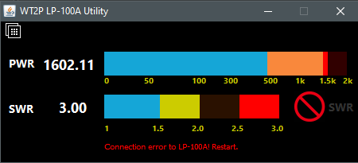

# LP100A OSD (On-Screen Display) Serial Interface

This is a Java application that allows for people to connect to a [LP-100A](http://www.telepostinc.com/lp100.html) device and display on screen forward Power and SWR as seen on the actual LP-100A wattmeter. The utility supports single coupler and dual coupler features (dual coupler sampling is detected automatically).

If you're using the latest firmware **(TBD)** for the LP-100A, the program will tell you which coupler (Radio 1 or Radio 2) is currently transmitting.

## Colors

Power Meter color schemes are indicated by the following:
 * Dark Blue for Low Power (0-500 watts)
 * Dark Yellow for Medium Power (500-1000 watts)
 * Dark Orange for High Power (1000-1500 watts)
 * Bright Red for 1500-2000 watts

SWR Meter color schemes are indicated by the following:
* Dark Blue: 1.0-1.49
* Yellow: 1.50-1.99
* Orange: 2.0 - 2.49
* Red: 2.50 +

If the SWR is above 3.0, an additional bright red alert text will display to the right of the SWR bargraph.

## Downloading and Installing

Click on [Releases](https://github.com/chibondking/wt2p_lp100a/releases) to get a list of current releases and download the WT2P_LP100A.zip file.

Unzip this file to a location easily remembered for you (i.e. c:\Ham\WT2P_LP100 - or similar)

### On Windows:

It's easiest to create a desktop shortcut. Right click on the JAR file and create shortcut. Edit your shortcut like this, specifying the command line options below

Move this to your Windows desktop.

### On Linux/OSX:

Start from the command line or create a link that passes in the correct parameters (com/serial port and latest firmware flag)

### Running

You can manually run this via the command line:

`java -jar WT2P-LP100A.jar <COM_PORT> <LATEST_LP_100_FIRMWARE>`

Where:
`COM_PORT` is the Com Port your LP-100A is running on (i.e. COM9 on Windows, /dev/ttyS0 on *NIX variants)

`LATEST_LP_100_FIRMWARE`  is set to true if you're running the latest LP-100A firmware (July/August 2018). You're probably not (yet), so this should be set to false.

`java -jar WT2P-LP100A.jar COM9 false`

You should see the LP-100A software display on screen and the text "connected" appears in the lower left corner of the screen. Apply RF from your radio and the application will display Power and SWR measurements from the LP-100A.

## Known Issues

* When switching modes via the LP-100A hardware interface, it will be necessary to restart the app.

## Future Plans

* Remote networking (client/server) support
* Dual Coupler Support: Identify which coupler has active RF
* Customize Power bar colors
* Customize SWR bar colors

## License
GPL v.3

Please feel free to contribute enhancements.