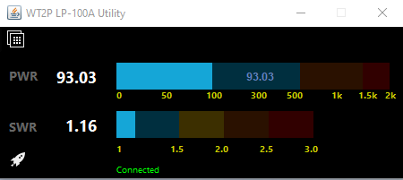

# LP100A OSD (On-Screen Display) Serial Interface
## Updated February 2022 - wt2p@cedrick.io

This is a Java application that allows for people to connect to a [LP-100A](http://www.telepostinc.com/lp100.html) 
device and display on screen forward Power and SWR as seen on the actual LP-100A wattmeter. 
The utility supports single coupler and dual coupler features (dual coupler sampling
is detected automatically within the LP-100 - if module is installed).

### Notable Fixes (January 2022)

* Bargraphs are now "uniform": No visible breaks between segments.

* Updated colorscheme: Colors are more appealing (to me, feedback always welcome) for extended 
operating sessions and the contrast allows for immediate identification of power and SWR levels.
* Smaller Size: 450 x 201 pixels makes it easy to tuck away on a busy operating screen
* Always On Top: With the smaller size, the utility window is now always on top of other
applications. This ensures that you have constant visibility into what is happening.
* Updated High SWR notice: Icon added for High SWR along with "SWR" text in red
anytime the SWR is above 3.0:1
* Connection Status: If there's an error connecting to the LP-100, it is now shown 
in the text area at the bottom of the utility. If there is a connection and the utility
is reading data from the LP-100, a small "rocket" icon appears in the lower left
and the connection status text displays "Connected" in green.
* Other minor cosmetic changes and behind the scenes updates. Removed stuff that will not be 
used. Will consider adding new stuff later. See the roadmap below.

 
## Colors

Power Meter color schemes are indicated by the following:
 * Blue: Low Power (0-500 watts)
 * Orange: Medium/High Power (500-1500 watts)
 * Bright Red: "Oops Power" (1500-2000 watts)

SWR Meter color schemes are indicated by the following:
* Blue: 1.0-1.49
* Yellow: 1.50-1.99
* Orange: 2.0 - 2.49
* Red: 2.50 +

If the SWR is above 3.0, an additional alert icon and text displays to the right of the SWR Bargraph.

## Prerequisites:

To run, you need the latest Java Runtime Environment installed. You can obtain this
from the [Oracle Java Website](https://java.com)

## Downloading and Installing

Click on [Releases](https://github.com/chibondking/wt2p_lp100a/releases) to get a list of current releases and download the WT2P_LP100A.zip file.

Unzip this file to a location easily remembered for you (i.e. c:\Ham\WT2P_LP100 - or similar)

### On Windows:

It's easiest to create a desktop shortcut. Right click on the JAR file and create shortcut. Edit your shortcut like this, specifying the command line options below

Move this to your Windows desktop.

### On Linux/OSX:

Start from the command line or create a link that passes in the correct parameter (com/serial port).

i.e. if you are using an usb-serial adapter:

`java -jar WT2P-LP100A.jar /dev/ttyUSB1`

You must use either sudo (not recommended) or give your serial/usb serial ports read-write access to your user.

#### On OSX:

There are a number of articles to identify the USB serial device that is plugged
in to your Mac and the LP-100A. This is what I used for testing on an OSX device:

`java -jar WT2P_LP100A.jar /dev/tty.usbserial-A504XGQ5 false`

Change your device name to fit your configuration.

### Running

You can manually run this via the command line:

`java -jar WT2P-LP100A.jar <COM_PORT>`

Where:
`COM_PORT` is the Com Port your LP-100A is running on (i.e. COM9 on Windows, /dev/ttyS0 on *NIX variants)

`java -jar WT2P-LP100A.jar COM9`

You should see the LP-100A software display on screen and the text "Connected" appears in the lower corner of the utility. 
Apply RF from your radio and the application will display Power and SWR measurements from the LP-100A.

## Known Issues

* When switching modes via the LP-100A hardware interface, it will be necessary to restart the app.

* OSX colors are not working properly. Marked for further investigation.

## Future Plans

* Remote networking (client/server) support
* Dual Coupler Support: Identify which coupler has active RF (Abandoned in 2022, no firmware support)
* As time permits, investigate using a config file to further customize items in the app. Send suggestions.

## License
GPL v.3

Please feel free to contribute enhancements.